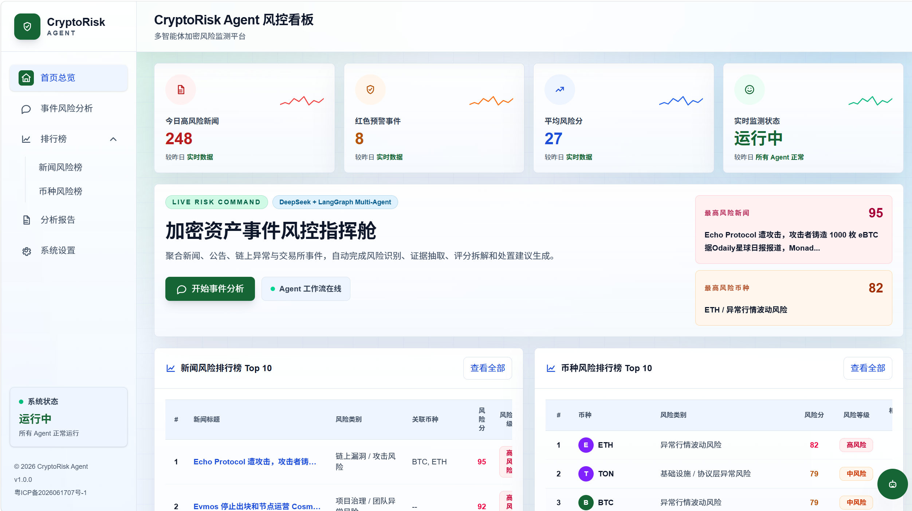
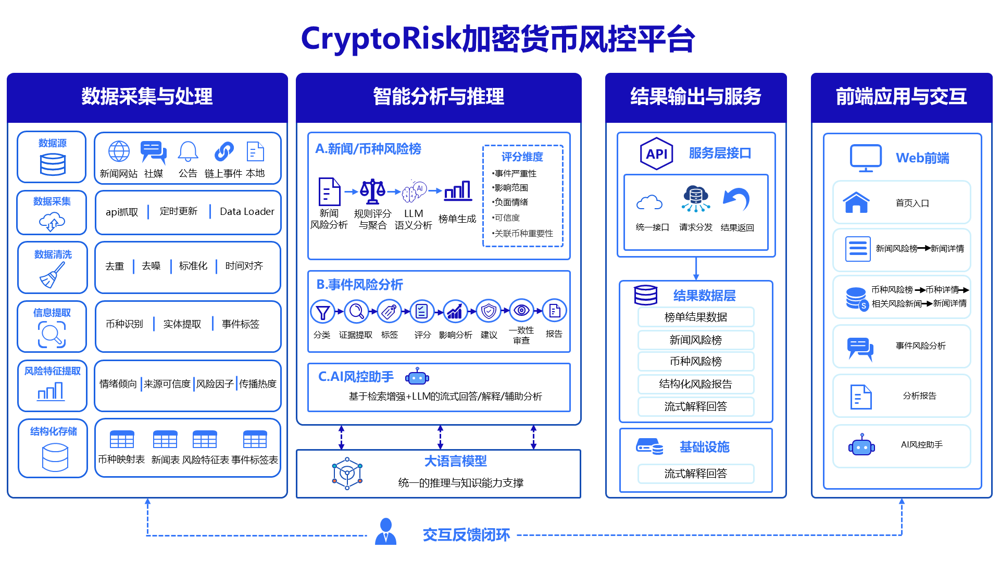

# CryptoRisk Agent

CryptoRisk Agent 是一个面向加密货币场景的金融风控 Multi-Agent 系统。系统通过聊天式交互和风险看板，对新闻、公告、项目事件、交易所异常、链上安全事件等信息进行风险识别、风险分类、风险评分、证据抽取、影响分析和处置建议生成，帮助用户快速判断事件风险等级与后续处理优先级。

> 本项目输出用于风险研判与安全分析辅助，不构成投资建议。

## 项目展示



## 核心能力

- 聊天式风控分析：输入事件描述、新闻摘要、公告内容或链上安全线索，生成结构化风险报告。
- 风险分类与评分：识别合约安全、交易所异常、项目运营、舆情传播、市场波动等风险类型，并给出风险等级。
- 证据抽取：从输入内容和新闻数据中抽取关键事实、触发原因、涉及主体和风险依据。
- 影响分析：分析事件可能影响的币种、项目、交易行为、用户资产和市场情绪。
- 处置建议：根据风险等级输出观察、核验、止损、防护、公告跟进等建议。
- 新闻风险排行：聚合新闻数据，生成高风险新闻榜单，方便快速定位重点事件。
- 币种风险排行：按币种维度汇总相关新闻和风险信号，展示风险热度与趋势。
- 上下文问答：围绕当前风险事件、排行榜或详情页内容进行追问和解释。

## 系统流程



系统整体分为前端交互层、后端服务层和 Agent 风控工作流：

1. 用户在前端输入事件、新闻或风险问题。
2. 后端接收请求并组织风控分析任务。
3. 多个 Agent 节点分别完成风险识别、分类、证据抽取、评分、影响分析和建议生成。
4. 系统对结果进行聚合与复核，生成可读的风控报告。
5. 前端以聊天窗口、排行榜和详情页形式展示分析结果。

## 技术栈

- 前端：Next.js、React、TypeScript、Tailwind CSS
- 后端：FastAPI、Python、Pydantic
- Agent 工作流：LangChain、LangGraph
- 数据处理：Pandas、本地新闻数据与风险评分缓存

## 目录结构

```text
.
├── backend/
│   ├── app/
│   │   ├── agents/          # 风控 Agent 与排行榜 Agent
│   │   ├── api/             # FastAPI 路由
│   │   ├── data/            # 新闻数据、评分缓存、更新脚本
│   │   ├── prompts/         # 风控分析提示词
│   │   ├── services/        # 分析服务、数据加载、聚合与问答
│   │   └── tools/           # Agent 工具节点
│   ├── main.py              # 后端入口
│   └── requirements.txt
├── frontend/
│   ├── app/                 # Next.js App Router 页面
│   ├── components/          # 风控看板、详情页与交互组件
│   ├── lib/                 # 前端 API 封装
│   └── package.json
├── docs/
│   ├── 主页图.png
│   └── 流程图.png
└── README.md
```

## 安装

### 1. 克隆项目

```bash
git clone <repository-url>
cd Hackathon
```

### 2. 安装后端依赖

```bash
cd backend
python -m venv .venv
source .venv/bin/activate
pip install -r requirements.txt
```

后端需要在运行环境中配置必要的服务密钥和参数。请将配置写入后端环境变量文件，密钥文件不要提交到代码仓库。

### 3. 安装前端依赖

```bash
cd frontend
npm install
```

前端通过相对路径请求后端接口，例如 `/api/chat`、`/api/rankings/news`。部署时由网关或反向代理负责把 `/api/` 请求转发到后端服务。

## 使用

### 启动后端服务

```bash
cd backend
source .venv/bin/activate
uvicorn main:app --reload
```

### 启动前端服务

```bash
cd frontend
npm run dev
```

启动完成后，在浏览器中打开前端页面即可使用聊天式风控分析、新闻风险排行榜、币种风险排行榜和详情页问答功能。

线上演示地址：

```text
https://kassa-wiki.top
```

## 主要页面

- 首页：提供聊天式风险分析入口和整体风险概览。
- 新闻风险榜：展示高风险新闻、风险分数、涉及币种和关键原因。
- 新闻详情页：展示单条新闻的风险分类、证据、影响分析与处置建议。
- 币种风险榜：按币种聚合相关新闻和风险信号，形成币种风险排序。
- 币种详情页：查看某个币种关联的风险事件、新闻证据和趋势变化。

## API 概览

- `POST /api/chat`：提交文本，生成风控分析报告。
- `POST /api/risk-assistant`：结合页面上下文进行风险问答。
- `POST /api/risk-assistant/stream`：流式风险问答。
- `GET /api/rankings/overview`：获取风险看板概览数据。
- `GET /api/rankings/news`：获取新闻风险排行榜。
- `GET /api/rankings/news/{news_id}`：获取新闻风险详情。
- `GET /api/rankings/coins`：获取币种风险排行榜。
- `GET /api/rankings/coins/{symbol}`：获取币种风险详情。
- `POST /api/rankings/update-news/jobs`：创建新闻更新任务。
- `GET /api/rankings/update-news/jobs/{job_id}`：查询新闻更新任务进度。

## 数据文件

- `backend/app/data/mastered_news.csv`：主新闻数据集。
- `backend/app/data/raw_news.csv`：增量新闻数据。
- `backend/app/data/scored_news.json`：已评分新闻缓存。
- `backend/app/data/saved_news/`：临时新闻抓取快照。

数据缓存文件可以根据演示和调试需要更新。提交代码前请确认密钥文件、虚拟环境、依赖目录、构建产物和临时数据未被提交。

## 适用场景

- 黑客松金融风控 Agent 项目展示。
- 加密货币新闻和公告的风险预警演示。
- 链上安全事件、交易所异常、项目舆情的辅助研判。
- 面向风控流程的 Multi-Agent 工作流原型验证。
